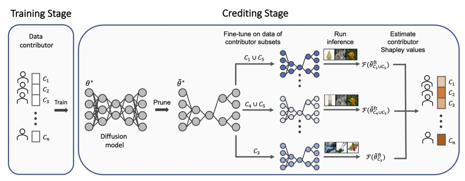

# An Efficient Framework for Crediting Data Contributors of Diffusion Models

[Paper]([https://arxiv.org/abs/2407.03153](https://openreview.net/pdf?id=9EqQC2ct4H))|[Project Page](https://q8888620002.github.io/contributor-attribution/)

## Overview
As diffusion models are deployed in real-world settings, and their performance is driven by training data, appraising the contribution of data contributors is crucial to creating incentives for sharing quality data and to implementing policies for data compensation. Depending on the use case, model performance corresponds to various global properties of the distribution learned by a diffusion model (e.g., overall aesthetic quality). Hence, here we address the problem of attributing global properties of diffusion models to data contributors. The Shapley value provides a principled approach to valuation by uniquely satisfying game-theoretic axioms of fairness. However, estimating Shapley values for diffusion models is computationally impractical because it requires retraining on many training data subsets corresponding to different contributors and rerunning inference. We introduce a method to efficiently retrain and rerun inference for Shapley value estimation, by leveraging model pruning and fine-tuning. We evaluate the utility of our method with three use cases: (i) image quality for a DDPM trained on a CIFAR dataset, (ii) demographic diversity for an LDM trained on CelebA-HQ, and (iii) aesthetic quality for a Stable Diffusion model LoRA-finetuned on Post-Impressionist artworks. Our results empirically demonstrate that our framework can identify important data contributors across models' global properties, outperforming existing attribution methods for diffusion models.



## Setup
### Install Required Packages
Set up a virtual environment with Python 3.11.5.
Before starting, ensure all required packages are installed:
```bash
pip install -r requirements.txt
```

### Set up Directory Paths
1. Create a `src/constants.py` file with the following content:
```
"""Global constant variables for the project."""

DATASET_DIR = "/gscratch/aims/datasets"
OUTDIR = "/gscratch/aims/diffusion-attr"
LOGDIR = "/gscratch/scrubbed/logdir/diffusion-attr"
MAX_NUM_SAMPLE_IMAGES_TO_SAVE = 64

```

2. Add the repo directory to PYTHONPATH:
```
cd data_attribution
export PYTHONPATH="$PYTHONPATH:$PWD"
```

### Directory Structure
```plaintext
├── src/  # Files for common Python functions and classes.
│   ├── ddpm_config.py
│   ├── utils.py
│   └── # some other module files
│
├── unconditional_generation/  # Files for unconditional diffusion models.
├── text_to_image/  # Files for text-to-image diffusion models.
```

## Bibltex
if you find this project useful in your research, please consider citing our paper
```
@inproceedings{luefficient,
  title={An Efficient Framework for Crediting Data Contributors of Diffusion Models},
  author={Lu, MingYu and Lin, Chris and Kim, Chanwoo and Lee, Su-In},
  booktitle={The Thirteenth International Conference on Learning Representations}
}
```


